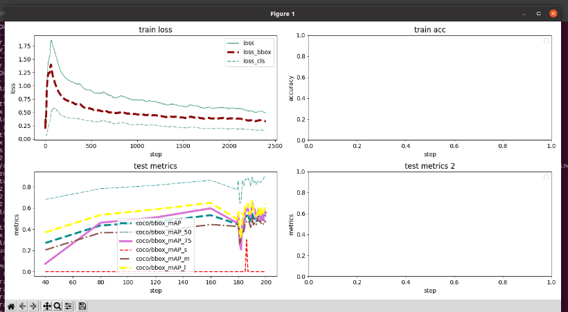
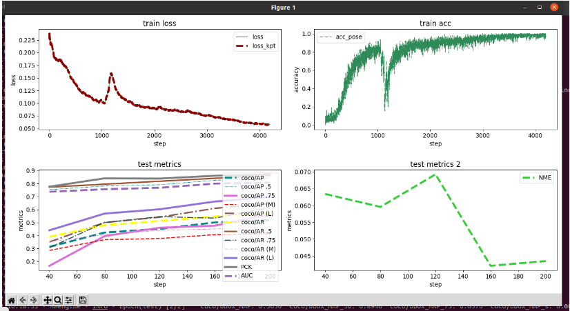

# MMpose、MMdetecetion安裝流程、RTMpose訓練流程
## mmpose
### 用mim安裝mmcv
```python=
pip install -U openmim
mim install mmengine
mim install mmcv
```
### 下載mmpose
```python=
git clone https://github.com/open-mmlab/mmpose.git
mim install "mmpose>=1.1.0"
```
### 檢查有沒有安裝成功
```python=
# 检查 mmcv
import mmcv
from mmcv.ops import get_compiling_cuda_version, get_compiler_version
print('MMCV版本', mmcv.__version__)
print('CUDA版本', get_compiling_cuda_version())
print('編譯器版本', get_compiler_version())
```
```python=
# 檢查 mmpose
import mmpose
print('mmpose版本', mmpose.__version__)
```

## mmdetection
### 下載mmdetection
```python=
git clone https://github.com/open-mmlab/mmdetection.git
mim install "mmdet>=3.1.0"
```
### 檢查有沒有安裝成功
```python=
# 檢查 mmpose
import mmdet
print('mmdetection版本', mmdet.__version__)
```
## 使用命令行進行預測
### 單張圖像進行預測
#### faster_rcnn + hrnet
```python=
python demo/topdown_demo_with_mmdet.py \ 
        demo/mmdetection_cfg/faster_rcnn_r50_fpn_coco.py \# 目標檢測模型的config文件
        https://download.openmmlab.com/mmdetection/v2.0/faster_rcnn/faster_rcnn_r50_fpn_1x_coco/faster_rcnn_r50_fpn_1x_coco_20200130-047c8118.pth \ # 目標檢測模型的模型權重文件
        configs/body_2d_keypoint/topdown_heatmap/coco/td-hm_hrnet-w32_8xb64-210e_coco-256x192.py \ # 關鍵點檢測的模型config文件
        https://download.openmmlab.com/mmpose/top_down/hrnet/hrnet_w32_coco_256x192-c78dce93_20200708.pth \# 關鍵點檢測模型的模型權重文件
        --input data/test/multi-person.jpeg \ # 要檢測的圖像或影片路徑
        --output-root outputs/B1_HRNet_1 \ # 模型預測結果保存位置
        --device cuda:0 \ # 指定gpu，也可以用cpu
        --bbox-thr 0.5 \ # 框檢測的置信度thredhold
        --kpt-thr 0.2 \ # 關鍵點檢測的置信度threshold
        --nms-thr 0.3 \# 框的nms iou threshold
        --radius 8 \ # 可視化關鍵點半徑
        --thickness 4 \ # 框的線寬
        --draw-bbox \ # 是否要畫框
        --draw-heatmap \ # 是否要化關鍵點熱力圖
        --show-kpt-idx  # 是否在點上標明是第幾號關鍵點
```

#### faster_rcnn + rtmpose
```python=
python demo/topdown_demo_with_mmdet.py \
        demo/mmdetection_cfg/faster_rcnn_r50_fpn_coco.py \
        https://download.openmmlab.com/mmdetection/v2.0/faster_rcnn/faster_rcnn_r50_fpn_1x_coco/faster_rcnn_r50_fpn_1x_coco_20200130-047c8118.pth \
        projects/rtmpose/rtmpose/body_2d_keypoint/rtmpose-s_8xb256-420e_coco-256x192.py \
        https://download.openmmlab.com/mmpose/v1/projects/rtmpose/rtmpose-s_simcc-aic-coco_pt-aic-coco_420e-256x192-fcb2599b_20230126.pth \
        --input data/test/multi-person.jpeg \
        --output-root outputs/B1_RTM_1 \
        --device cuda:0 \
        --bbox-thr 0.5 \
        --kpt-thr 0.5 \
        --nms-thr 0.3 \
        --radius 8 \
        --thickness 4 \
        --draw-bbox \
        --draw-heatmap \
        --show-kpt-idx
```

### 對影片處理
#### faster_rcnn + hrnet
```python=
python demo/topdown_demo_with_mmdet.py \
        demo/mmdetection_cfg/faster_rcnn_r50_fpn_coco.py \
        https://download.openmmlab.com/mmdetection/v2.0/faster_rcnn/faster_rcnn_r50_fpn_1x_coco/faster_rcnn_r50_fpn_1x_coco_20200130-047c8118.pth \
        configs/body_2d_keypoint/topdown_heatmap/coco/td-hm_hrnet-w32_8xb64-210e_coco-256x192.py \
        https://download.openmmlab.com/mmpose/top_down/hrnet/hrnet_w32_coco_256x192-c78dce93_20200708.pth \
        --input data/test/mother_wx.mp4 \
        --output-root outputs/B1_HRNet_2 \
        --device cuda:0 \
        --bbox-thr 0.5 \
        --kpt-thr 0.2 \
        --nms-thr 0.3 \
        --radius 5 \
        --thickness 2 \
        --draw-bbox \
        --draw-heatmap \
        --show-kpt-idx
```
#### faster_rcnn + rtmpose
```python=
python demo/topdown_demo_with_mmdet.py \
        demo/mmdetection_cfg/faster_rcnn_r50_fpn_coco.py \
        https://download.openmmlab.com/mmdetection/v2.0/faster_rcnn/faster_rcnn_r50_fpn_1x_coco/faster_rcnn_r50_fpn_1x_coco_20200130-047c8118.pth \
        projects/rtmpose/rtmpose/body_2d_keypoint/rtmpose-s_8xb256-420e_coco-256x192.py \
        https://download.openmmlab.com/mmpose/v1/projects/rtmpose/rtmpose-s_simcc-aic-coco_pt-aic-coco_420e-256x192-fcb2599b_20230126.pth \
        --input data/test/mother_wx.mp4 \
        --output-root outputs/B1_RTM_2 \
        --device cuda:0 \
        --bbox-thr 0.5 \
        --kpt-thr 0.5 \
        --nms-thr 0.3 \
        --radius 5 \
        --thickness 2 \
        --draw-bbox \
        --draw-heatmap \
        --show-kpt-idx
```

## 用python api調用
- 要記得執行的py檔要跟mmdetection、mmpose平行，不能放在裡面，會有找不到包的問題
### 導入必要的函數和類
```python=
import cv2
import os
from PIL import Image
import matplotlib.pyplot as plt
import torch
import mmcv
import numpy as np
from mmcv import imread
import mmengine
from mmengine.registry import init_default_scope

from mmpose.apis import inference_topdown # 姿態檢測推論
from mmpose.apis import init_model as init_pose_estimator # 初始化姿態檢測模型
from mmpose.evaluation.functional import nms
from mmpose.registry import VISUALIZERS
from mmpose.structures import merge_data_samples

from mmdet.apis import inference_detector # 推論目標檢測模型需要
from mmdet.apis import init_detector # 初始化目標檢測模型
device = torch.device('cuda:0' if torch.cuda.is_available() else 'cpu')
# 檢測圖像
img_path = './mmpose/data/test/multi-person.jpeg'
```

#### 建構目標檢測模型
```python=
# 建構目標檢測模型
## faster-rcnn
detector = init_detector(
    'mmpose/demo/mmdetection_cfg/faster_rcnn_r50_fpn_coco.py', # 目標檢測模型config
    'https://download.openmmlab.com/mmdetection/v2.0/faster_rcnn/faster_rcnn_r50_fpn_1x_coco/faster_rcnn_r50_fpn_1x_coco_20200130-047c8118.pth', # 對應權重
    device=device
)
```
#### 建構姿態檢測模型
```python=
pose_estimator = init_pose_estimator(
    'mmpose/configs/body_2d_keypoint/topdown_heatmap/coco/td-hm_hrnet-w32_8xb64-210e_coco-256x192.py',
    'https://download.openmmlab.com/mmpose/top_down/hrnet/hrnet_w32_coco_256x192-c78dce93_20200708.pth',
    device=device,
    cfg_options={'model': {'test_cfg': {'output_heatmaps': True}}}
)
```

#### 開始推論目標檢測模型
```python=
init_default_scope(detector.cfg.get('default_scope', 'mmdet'))
# 預測框
detect_result = inference_detector(detector, img_path)
```
- detect_result裡面有三種結果
  - detect_result.pred_instances.labels:預測出來的框的類別
  - detect_result.pred_instances.scores:預測出來的置信度
  - detect_result.pred_instances.bboxes:預測出來的框座標
```python=
# 預測出來的框的類別
tensor([ 0,  0,  0,  0,  0,  0,  0,  0,  0, 11,  0, 58,  0,  0, 58,  0,  0,  2,
         0,  0,  2,  0,  0,  0,  0, 24,  2, 58, 26, 26,  0,  0, 58,  0, 26,  0,
        27, 24,  0, 26, 26, 26, 26, 26, 58,  0, 26, 26, 26,  2, 32,  2, 58, 39,
         2,  0, 58, 24, 58, 32, 24, 26,  0,  0,  2, 37,  0, 39,  9, 74,  0,  2,
        58, 24,  0,  0, 26, 29], device='cuda:0')
```
  
```python=
# 預測出來的置信度
tensor([0.9994, 0.9988, 0.9974, 0.9963, 0.9959, 0.9930, 0.9914, 0.9901, 0.9868,
        0.9824, 0.9632, 0.9272, 0.9080, 0.8950, 0.8794, 0.8582, 0.8248, 0.8189,
        0.7240, 0.7185, 0.7055, 0.6654, 0.6203, 0.6010, 0.6003, 0.5710, 0.5653,
        0.5058, 0.4549, 0.4088, 0.3942, 0.3909, 0.3533, 0.3103, 0.3030, 0.2594,
        0.2292, 0.2223, 0.2156, 0.1888, 0.1866, 0.1847, 0.1792, 0.1770, 0.1716,
        0.1673, 0.1398, 0.1391, 0.1390, 0.1373, 0.1348, 0.1251, 0.1205, 0.1156,
        0.1132, 0.1121, 0.1010, 0.1009, 0.0940, 0.0921, 0.0919, 0.0914, 0.0885,
        0.0821, 0.0805, 0.0724, 0.0697, 0.0687, 0.0675, 0.0630, 0.0626, 0.0624,
        0.0587, 0.0578, 0.0557, 0.0536, 0.0510, 0.0502], device='cuda:0')
```
```python=
# 預測出來的框座標
tensor([[1705.6440,   96.2784, 2114.5181, 1301.1793],
        [1267.5966,   94.7074, 1701.0554, 1316.2964],
        [ 720.3899,  172.2511, 1152.6925, 1267.8408],
        [   7.2623,  238.2423,  170.9962, 1140.8058],
        [1063.1945,  219.2218, 1348.9850, 1244.7227],
        [ 436.2329,  428.5780,  586.0933,  911.8918],
        [ 110.0086,  212.1305,  324.6433, 1123.0087],
        [2079.3340,  478.2407, 2224.4050,  925.2119],
        [ 543.7142,  406.4844,  650.8373,  919.4562],
        [ 514.5025,  341.8667,  580.5118,  430.7810],
```

#### 先對框的置信度篩選以及過nms
```python=
CONF_THRES = 0.5
pred_instance = detect_result.pred_instances.cpu().numpy()
bboxes = np.concatenate(
    (pred_instance.bboxes, pred_instance.scores[:, None]),
    axis=1
)
bboxes = bboxes[np.logical_and(pred_instance.labels == 0, pred_instance.scores > CONF_THRES)]
bboxes = bboxes[nms(bboxes, 0.3)][:, :4]
```
```python=
[[1705.644       96.27843   2114.518     1301.1793   ]
 [1267.5966      94.70741   1701.0554    1316.2964   ]
 [ 720.3899     172.25111   1152.6925    1267.8408   ]
 [   7.2623434  238.24232    170.99622   1140.8058   ]
 [1063.1945     219.22185   1348.985     1244.7227   ]
 [ 436.23294    428.578      586.0933     911.8918   ]
 [ 110.008575   212.1305     324.64334   1123.0087   ]
 [2079.334      478.2407    2224.405      925.2119   ]
 [ 543.71423    406.48438    650.8373     919.45624  ]
 [2363.2996     501.87018   2455.2249     857.3131   ]
 [2308.198      561.452     2372.7478     715.77356  ]
 [1990.6115     485.11075   2105.6335     923.43585  ]
 [2255.5374     568.44867   2326.8682     702.4399   ]
 [ 830.3834     297.209      897.04095    349.59286  ]
 [ 704.9932     419.58734    808.69116    989.6153   ]
 [1646.6818     484.40222   1787.3245     936.4998   ]
 [2437.2583     596.7592    2516.5012     722.8496   ]
 [2176.0432     506.09534   2239.0227     640.1096   ]]
```

#### 關鍵點預測
```python=
pose_results = inference_topdown(pose_estimator, img_path, bboxes) # 元數據
data_samples = merge_data_samples(pose_results) # 把他們打包到一起
# ['pred_instances', '_pred_heatmaps', 'pred_fields', 'gt_instances']
```
```python=
# 每个人 17个关键点 坐标
data_samples.pred_instances.keypoints.shape
(18, 17, 2)
[[[1915.9644    186.88135 ]
  [1927.731     175.11473 ]
  [1892.4312    175.11473 ]
  [1963.0308    198.64795 ]
  [1857.1313    186.88135 ]
  [2010.0973    316.31406 ]
  [1810.0648    328.08066 ]
  [2092.4636    492.8132  ]
  [1786.5316    445.74677 ]
  [1986.564     410.44693 ]
  [1762.9984    504.5798  ]
  [1963.0308    657.5458  ]
  [1821.8314    645.7791  ]
  [1939.4976    939.9444  ]
  [1821.8314    904.64453 ]
  [1927.731    1116.4435  ]
  [1857.1313   1187.0432  ]]

 [[1490.2908    234.2835  ]
  [1514.1499    210.42433 ]
  [1466.4315    210.42433 ]
  [1538.009     210.42433 ]
  [1418.7133    210.42433 ]
  [1585.7273    341.64972 ]
```

```python=
data_samples.gt_instances.bboxes
[[1705.644       96.27843   2114.518     1301.1793   ]
 [1267.5966      94.70741   1701.0554    1316.2964   ]
 [ 720.3899     172.25111   1152.6925    1267.8408   ]
 [   7.2623434  238.24232    170.99622   1140.8058   ]
 [1063.1945     219.22185   1348.985     1244.7227   ]
 [ 436.23294    428.578      586.0933     911.8918   ]
 [ 110.008575   212.1305     324.64334   1123.0087   ]
 [2079.334      478.2407    2224.405      925.2119   ]
 [ 543.71423    406.48438    650.8373     919.45624  ]
 [2363.2996     501.87018   2455.2249     857.3131   ]
 [2308.198      561.452     2372.7478     715.77356  ]
 [1990.6115     485.11075   2105.6335     923.43585  ]
 [2255.5374     568.44867   2326.8682     702.4399   ]
 [ 830.3834     297.209      897.04095    349.59286  ]
 [ 704.9932     419.58734    808.69116    989.6153   ]
 [1646.6818     484.40222   1787.3245     936.4998   ]
 [2437.2583     596.7592    2516.5012     722.8496   ]
 [2176.0432     506.09534   2239.0227     640.1096   ]]
```
- 可以看每個關鍵點的熱力圖
```python=
data_samples.pred_fields.heatmaps.shape
(17, 1418, 2520)
```
```python=
idx_point = 13 # 假設要畫第13個關節點熱力圖
heatmap = data_samples.pred_fields.heatmaps[idx_point,:,:]
plt.imshow(heatmap)
plt.show()
```


# 設定半徑跟線寬
```python=
pose_estimator.cfg.visualizer.radius = 10
pose_estimator.cfg.visualizer.line_width = 8
visualizer = VISUALIZERS.build(pose_estimator.cfg.visualizer)

visualizer.set_dataset_meta(pose_estimator.dataset_meta) # 一些基本信息，顏色、關節點之間如何連接等等
img = mmcv.imread(img_path)
img = mmcv.imconvert(img, 'bgr', 'rgb')
img_output = visualizer.add_datasample(
            'result',
            img,
            data_sample=data_samples,
            draw_gt=False,
            draw_heatmap=True,
            draw_bbox=True,
            show_kpt_idx=True,
            show=False,
            wait_time=0,
            out_file='outputs/B2.jpg'
)
plt.figure(figsize=(10,10))
plt.imshow(img_output)
plt.show()
```


## 訓練自己數據集

### 建構數據集
- 建議使用pose_tools裡面的工具進行轉換


### 要進mmpose跟mmdetection進行個別訓練

### 先訓練目標檢測
- 新增數據集
- 格式
  - mmdetection:
    - data 
      - keypoint_coco
        - images
        - train_coco.json
        - val_coco.json 
    - rtmdet_m-carpose.py # 我們準備的config檔
  - mmpose:
    - data 
      - keypoint_coco
        - images
        - train_coco.json
        - val_coco.json   
    - rtmpose-m-carpose.py
### 訓練時要把numpy版本降下來，因為np.float會出錯(cocoapi)
- 降到1.23.5

# mmpose/mmdetection訓練流程
## mmdetection
### 訓練config檔
可見mmdetection/data/rtmdet_m-carpose.py
```python=
dataset_type = 'CocoDataset'
data_root = 'data/carpose_keypoint_coco/'
metainfo = {'classes': ('car',)}
NUM_CLASSES = len(metainfo['classes'])
```
在mmdetection/data/rtmdet_m-carpose.py裡面，可以調整模型大小，可以複製下面模型覆蓋原有模型
```python=
# 選擇rtmdet模型
# https://github.com/open-mmlab/mmdetection/tree/3.x/configs/rtmdet
# RTMDet-tiny 
load_from = 'https://download.openmmlab.com/mmdetection/v3.0/rtmdet/rtmdet_tiny_8xb32-300e_coco/rtmdet_tiny_8xb32-300e_coco_20220902_112414-78e30dcc.pth'
backbone_pretrain = 'https://download.openmmlab.com/mmdetection/v3.0/rtmdet/cspnext_rsb_pretrain/cspnext-tiny_imagenet_600e.pth'
deepen_factor=0.167
widen_factor=0.375
in_channels=[96, 192, 384]
neck_out_channels=96
num_csp_blocks=1
exp_on_reg=False
```
```python=
# RTMDet-s
load_from = 'https://download.openmmlab.com/mmdetection/v3.0/rtmdet/rtmdet_s_8xb32-300e_coco/rtmdet_s_8xb32-300e_coco_20220905_161602-387a891e.pth'
backbone_pretrain = 'https://download.openmmlab.com/mmdetection/v3.0/rtmdet/cspnext_rsb_pretrain/cspnext-s_imagenet_600e-ea671761.pth'
deepen_factor=0.33
widen_factor=0.5
in_channels=[128, 256, 512]
neck_out_channels=128
num_csp_blocks=1
exp_on_reg=False
```
```python=
# RTMDet-m
load_from = 'https://download.openmmlab.com/mmdetection/v3.0/rtmdet/rtmdet_m_8xb32-300e_coco/rtmdet_m_8xb32-300e_coco_20220719_112220-229f527c.pth'
backbone_pretrain = 'https://download.openmmlab.com/mmdetection/v3.0/rtmdet/cspnext_rsb_pretrain/cspnext-m_8xb256-rsb-a1-600e_in1k-ecb3bbd9.pth'
deepen_factor=0.67
widen_factor=0.75
in_channels=[192, 384, 768]
neck_out_channels=192
num_csp_blocks=2
exp_on_reg=True
```
```python=
# RTMDet-l
load_from = 'https://download.openmmlab.com/mmdetection/v3.0/rtmdet/rtmdet_l_8xb32-300e_coco/rtmdet_l_8xb32-300e_coco_20220719_112030-5a0be7c4.pth'
backbone_pretrain = 'https://download.openmmlab.com/mmdetection/v3.0/rtmdet/cspnext_rsb_pretrain/cspnext-l_8xb256-rsb-a1-600e_in1k-6a760974.pth'
deepen_factor=1
widen_factor=1
in_channels=[256, 512, 1024]
neck_out_channels=256
num_csp_blocks=3
exp_on_reg=True
```
#### 超參數
```python=
MAX_EPOCHS = 200
TRAIN_BATCH_SIZE = 4
VAL_BATCH_SIZE = 2
stage2_num_epochs = 20
base_lr = 0.004
VAL_INTERVAL = 5
```

### 訓練
```python=
cd mmdetection
# 訓練
python tools/train.py data/rtmdet-m-carpose.py
# 測試
python tools/test.py data/rtmdet_m-carpose.py work_dirs/rtmdet_m-carpose/best_coco_bbox_mAP_epoch_190.pth
# 模型權重精簡轉換
python tools/model_converters/publish_model.py work_dirs/rtmdet_m-carpose/best_coco_bbox_mAP_epoch_190.pth checkpoint/rtmdet-m-carpose-200.pth

# 視覺化
cd mmdetection
python vidualize.py # 要去裡面改參數
```



## mmpose
### 訓練config檔
可見mmpose/data/rtmpose-m-carpose.py
```python=
dataset_type = 'CocoDataset'
data_mode = 'topdown'
data_root = 'data/carpose_keypoint_coco/'
```
- data_root為訓練資料的位置，結構為
    - images
    - train_coco.json
    - val_coco.json

```python=
dataset_info = {
    'dataset_name':'carpose_keypoint_coco',
    'classes':'car',
    'paper_info':{
    },
    'keypoint_info':{
        0:{'name':'left-front-bumper','id':0,'color':[0,0,255],'type': '','swap': ''},
        1:{'name':'left-rear-bumper','id':1,'color':[255,0,0],'type': '','swap': ''},
        2:{'name':'left-front-tire','id':2,'color':[255,100,0],'type': '','swap': ''},
        3:{'name':'left-rear-tire','id':3,'color':[0, 255, 0],'type': '','swap': ''},
        4:{'name':'right-front-bumper','id':4,'color':[0, 255, 255],'type': '','swap': ''},
        5:{'name':'right-rear-bumper','id':5,'color':[193, 182, 255],'type': '','swap': ''},
        6:{'name':'right-front-tire','id':6,'color':[193, 100, 255],'type': '','swap': ''},
        7:{'name':'right-rear-tire','id':7,'color':[16, 144, 247],'type': '','swap': ''}
        
    },
    'skeleton_info': {
        0: {'link':('left-front-bumper','left-rear-bumper'),'id': 0,'color': [100,150,200]},
        1: {'link':('left-front-tire','left-rear-tire'),'id': 1,'color': [200,100,150]},
        2: {'link':('right-front-bumper','right-rear-bumper'),'id': 2,'color': [150,120,100]},
        3: {'link':('right-front-bumper','right-rear-bumper'),'id': 3,'color': [150,120,0]}
    }
}
```

```python=
max_epochs = 10 # epoch總數
val_interval = 10 # 每隔幾次保存一次文件
train_cfg = {'max_epochs': max_epochs, 'val_interval': val_interval}
train_batch_size = 32 # 訓練batch
val_batch_size = 8
stage2_num_epochs = 0
base_lr = 4e-3
randomness = dict(seed=21)
```
```python=
# codec settings
codec = dict(
    type='SimCCLabel',
    input_size=(256, 256), # 這邊設定不同尺寸輸入(256、384、512、1024)
    sigma=(12, 12), # 表示轉換高斯分布分布的標準差，越大越容易學習，但精度上限會降低，越小越嚴格，對於人體、人臉高精度場景，可以調小，論文中為5.66
    simcc_split_ratio=2.0,
    normalize=False,
    use_dark=False)
```

## 模型
### RTMPose-S
```python=
model = dict(
    type='TopdownPoseEstimator',
    data_preprocessor=dict(
        type='PoseDataPreprocessor',
        mean=[123.675, 116.28, 103.53],
        std=[58.395, 57.12, 57.375],
        bgr_to_rgb=True),
    backbone=dict(
        _scope_='mmdet',
        type='CSPNeXt',
        arch='P5',
        expand_ratio=0.5,
        deepen_factor=0.33,
        widen_factor=0.5,
        out_indices=(4, ),
        channel_attention=True,
        norm_cfg=dict(type='SyncBN'),
        act_cfg=dict(type='SiLU'),
        init_cfg=dict(
            type='Pretrained',
            prefix='backbone.',
            checkpoint='https://download.openmmlab.com/mmdetection/v3.0/rtmdet/cspnext_rsb_pretrain/cspnext-s_imagenet_600e-ea671761.pth'
        )),
    head=dict(
        type='RTMCCHead',
        in_channels=512,
        out_channels=NUM_KEYPOINTS,
        input_size=codec['input_size'],
        in_featuremap_size=(8, 8),
        simcc_split_ratio=codec['simcc_split_ratio'],
        final_layer_kernel_size=7,
        gau_cfg=dict(
            hidden_dims=256,
            s=128,
            expansion_factor=2,
            dropout_rate=0.,
            drop_path=0.,
            act_fn='SiLU',
            use_rel_bias=False,
            pos_enc=False),
        loss=dict(
            type='KLDiscretLoss',
            use_target_weight=True,
            beta=10.,
            label_softmax=True),
        decoder=codec),
    test_cfg=dict(flip_test=True))
```
### RTMPose-M
```python=
model = dict(
    type='TopdownPoseEstimator',
    data_preprocessor=dict(
        type='PoseDataPreprocessor',
        mean=[123.675, 116.28, 103.53],
        std=[58.395, 57.12, 57.375],
        bgr_to_rgb=True),
    backbone=dict(
        _scope_='mmdet',
        type='CSPNeXt',
        arch='P5',
        expand_ratio=0.5,
        deepen_factor=0.67,
        widen_factor=0.75,
        out_indices=(4, ),
        channel_attention=True,
        norm_cfg=dict(type='SyncBN'),
        act_cfg=dict(type='SiLU'),
        init_cfg=dict(
            type='Pretrained',
            prefix='backbone.',
            checkpoint='https://download.openmmlab.com/mmdetection/v3.0/rtmdet/cspnext_rsb_pretrain/cspnext-m_8xb256-rsb-a1-600e_in1k-ecb3bbd9.pth'
        )),
    head=dict(
        type='RTMCCHead',
        in_channels=768,
        out_channels=NUM_KEYPOINTS,
        input_size=codec['input_size'],
        in_featuremap_size=(8, 8),
        simcc_split_ratio=codec['simcc_split_ratio'],
        final_layer_kernel_size=7,
        gau_cfg=dict(
            hidden_dims=256,
            s=128,
            expansion_factor=2,
            dropout_rate=0.,
            drop_path=0.,
            act_fn='SiLU',
            use_rel_bias=False,
            pos_enc=False),
        loss=dict(
            type='KLDiscretLoss',
            use_target_weight=True,
            beta=10.,
            label_softmax=True),
        decoder=codec),
    test_cfg=dict(flip_test=True))
```
### RTMPose-L
```python=
model = dict(
    type='TopdownPoseEstimator',
    data_preprocessor=dict(
        type='PoseDataPreprocessor',
        mean=[123.675, 116.28, 103.53],
        std=[58.395, 57.12, 57.375],
        bgr_to_rgb=True),
    backbone=dict(
        _scope_='mmdet',
        type='CSPNeXt',
        arch='P5',
        expand_ratio=0.5,
        deepen_factor=1.,
        widen_factor=1.,
        out_indices=(4, ),
        channel_attention=True,
        norm_cfg=dict(type='SyncBN'),
        act_cfg=dict(type='SiLU'),
        init_cfg=dict(
            type='Pretrained',
            prefix='backbone.',
            checkpoint='https://download.openmmlab.com/mmdetection/v3.0/rtmdet/cspnext_rsb_pretrain/cspnext-l_8xb256-rsb-a1-600e_in1k-6a760974.pth'
        )),
    head=dict(
        type='RTMCCHead',
        in_channels=1024,
        out_channels=NUM_KEYPOINTS,
        input_size=codec['input_size'],
        in_featuremap_size=(8, 8),
        simcc_split_ratio=codec['simcc_split_ratio'],
        final_layer_kernel_size=7,
        gau_cfg=dict(
            hidden_dims=256,
            s=128,
            expansion_factor=2,
            dropout_rate=0.,
            drop_path=0.,
            act_fn='SiLU',
            use_rel_bias=False,
            pos_enc=False),
        loss=dict(
            type='KLDiscretLoss',
            use_target_weight=True,
            beta=10.,
            label_softmax=True),
        decoder=codec),
    test_cfg=dict(flip_test=True))
```
### RTMPose-X
```python=
model = dict(
    type='TopdownPoseEstimator',
    data_preprocessor=dict(
        type='PoseDataPreprocessor',
        mean=[123.675, 116.28, 103.53],
        std=[58.395, 57.12, 57.375],
        bgr_to_rgb=True),
    backbone=dict(
        _scope_='mmdet',
        type='CSPNeXt',
        arch='P5',
        expand_ratio=0.5,
        deepen_factor=1.33,
        widen_factor=1.25,
        out_indices=(4, ),
        channel_attention=True,
        norm_cfg=dict(type='SyncBN'),
        act_cfg=dict(type='SiLU'),
        init_cfg=dict(
            type='Pretrained',
            prefix='backbone.',
            checkpoint='https://download.openmmlab.com/mmdetection/v3.0/rtmdet/cspnext_rsb_pretrain/cspnext-x_8xb256-rsb-a1-600e_in1k-b3f78edd.pth'
        )),
    head=dict(
        type='RTMCCHead',
        in_channels=1280,
        out_channels=NUM_KEYPOINTS,
        input_size=codec['input_size'],
        in_featuremap_size=(32, 32),
        simcc_split_ratio=codec['simcc_split_ratio'],
        final_layer_kernel_size=7,
        gau_cfg=dict(
            hidden_dims=256,
            s=128,
            expansion_factor=2,
            dropout_rate=0.,
            drop_path=0.,
            act_fn='SiLU',
            use_rel_bias=False,
            pos_enc=False),
        loss=dict(
            type='KLDiscretLoss',
            use_target_weight=True,
            beta=10.,
            label_softmax=True),
        decoder=codec),
    test_cfg=dict(flip_test=True))
```

## 訓練
- 假設上面的config檔檔名為rtmpose-s-carpose.py
```python=
cd mmpose
# 訓練
python tools/train.py data/rtmpose-s-carpose.py
# 評估
python tools/test.py data/rtmpose-s-carpose.py \
                      work_dirs/rtmpose-s-carpose/epoch_300.pth
# 模型權重精簡轉換
python tools/misc/publish_model.py \
        work_dirs/rtmpose-s-carpose/epoch_300.pth \
        checkpoint/rtmpose-s-carpose-300.pth

python vidualize.py # 要去裡面改參數
```
